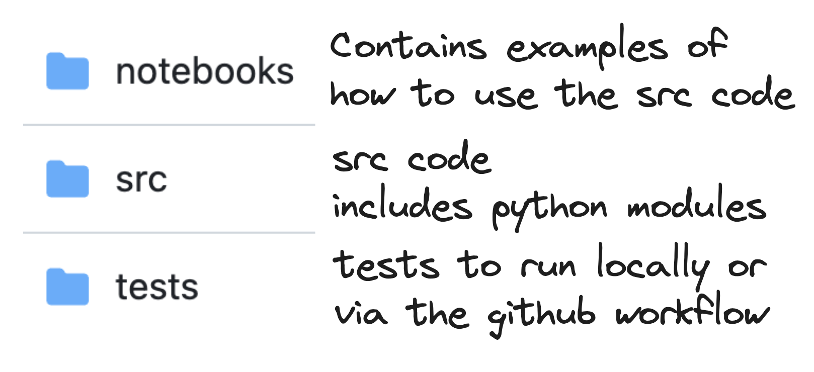
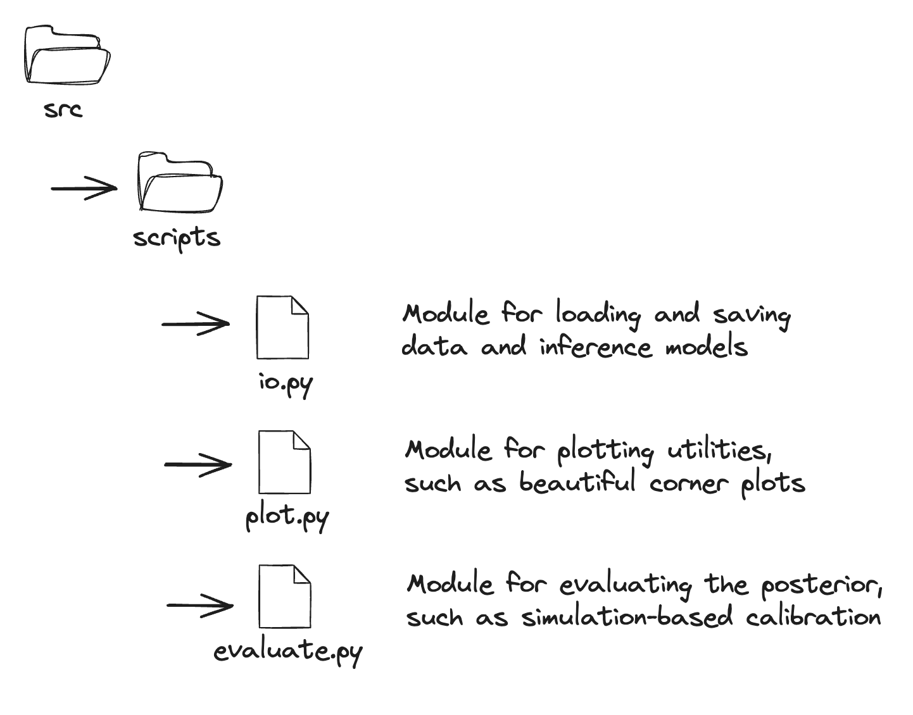

# DeepDiagnostics
DeepDiagnostics is a package for diagnosing the posterior from an inference method. It is flexible, applicable for both simulation-based and likelihood-based inference.

(arxiv link if applicable)

(pypi link if applicable)

(MIT or Apache 2.0 or another requires link changed)


## Workflow


Getting a little more specific:



## Installation 

### Clone this repo
First, cd to where you'd like to put this repo and type:
> git clone https://github.com/deepskies/DeepDiagnostics.git

Then, cd into the repo:
> cd DeepDiagnostics

### Install and use poetry to set up the environment
Poetry is our recommended method of handling a package environment as publishing and building is handled by a toml file that handles all possibly conflicting dependencies. 
Full docs can be found [here](https://python-poetry.org/docs/basic-usage/).

Install instructions: 

Add poetry to your python install 
> pip install poetry

Then, from within the DeepDiagnostics repo, run the following:

Install the pyproject file
> poetry install 

Begin the environment
> poetry shell

### Verify it is installed

After following the installation instructions, verify installation is functional is all tests are passing by running the following in the root directory:
> pytest


## Quickstart

**Fill this in is TBD**

Description of the immediate steps to replicate your results, pointing to a script with cli execution. 
You can also point to a notebook if your results are highly visual and showing plots in line with code is desired.

Example: 

To run full model training: 
> python3 train.py --data /path/to/data/folder

To evaluate a single ""data format of choice""
> python3 eval.py --data /path/to/data

## Documentation 
Please include any further information needed to understand your work. 
This can include an explanation of different notebooks, basic code diagrams, conceptual explanations, etc. 
If you have a folder of documentation, summarize it here and point to it. 

## Citation 
Include a link to your bibtex citation for others to use. 

```
@article{key , 
    author = {You :D}, 
    title = {title}, 
    journal = {journal}, 
    volume = {v}, 
    year = {20XX}, 
    number = {X}, 
    pages = {XX--XX}
}

```

## Acknowledgement 
Include any acknowledgements for research groups, important collaborators not listed as a contributor, institutions, etc. 
